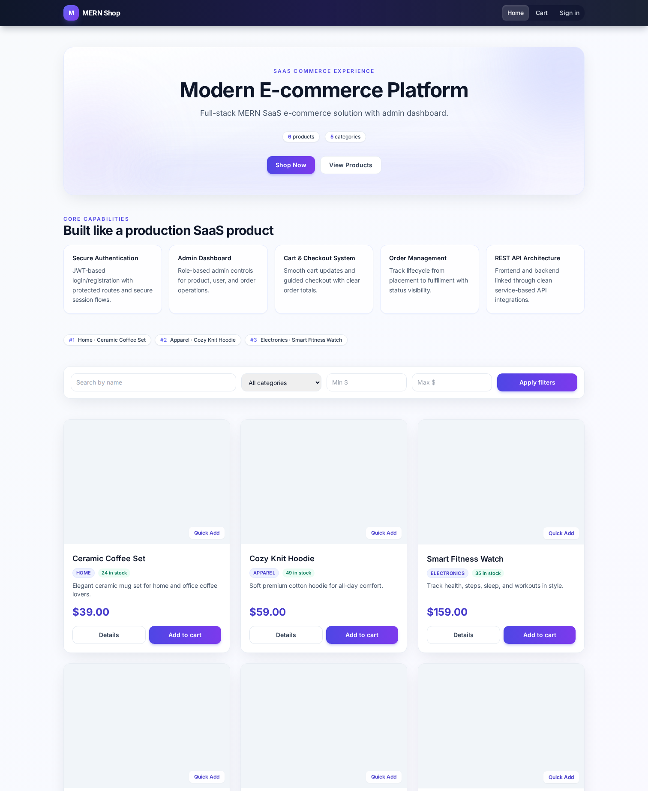
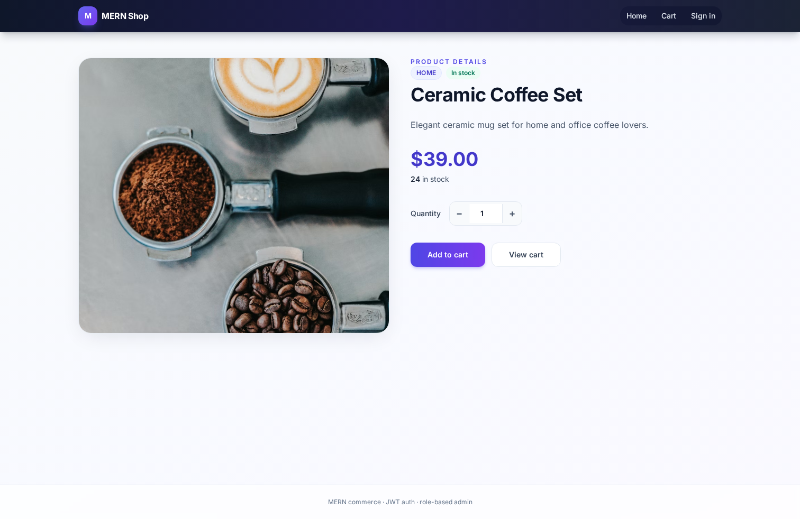
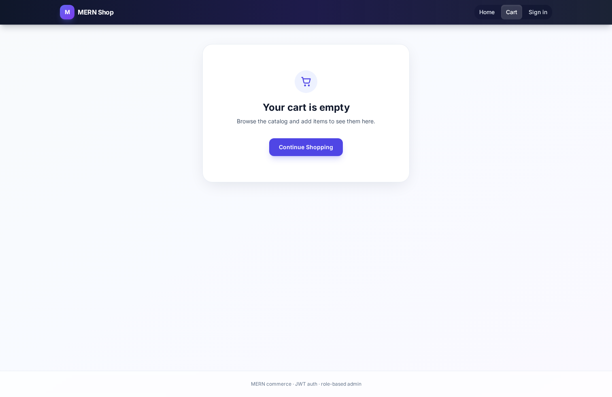
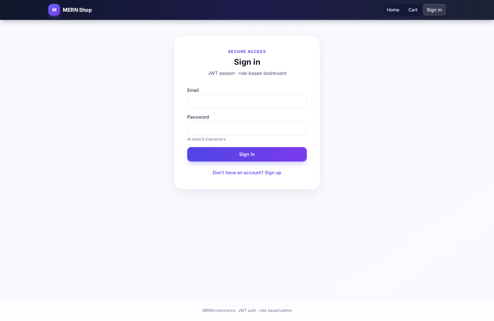

# 🛒 MERN E-commerce SaaS Platform

[](./LICENSE)
[](https://react.dev/)
[](https://nodejs.org/)
[](https://www.mongodb.com/atlas)
[](https://vercel.com/)

---

## 📌 Overview

A **production-style** full-stack e-commerce app on the **MERN** stack: **JWT auth** (access + refresh), **role-based admin**, **catalog with search / filters / pagination / reviews**, **cart and checkout**, **orders**, **Stripe-ready payments**, and **Cloudinary-ready uploads**—with a **Tailwind** UI suitable for portfolio and interviews.

This is an **evolved codebase** (not a throwaway demo): clear separation between UI and API, environment-based configuration, and CI checks.

---

## 🚀 Live demo

| | Link |
|---|------|
| **Frontend** | [https://ecommerece-mern-web.vercel.app](https://ecommerece-mern-web.vercel.app) |
| **Backend API** | [https://backend-two-weld-46.vercel.app](https://backend-two-weld-46.vercel.app) |
| **Health** | [https://backend-two-weld-46.vercel.app/api/health](https://backend-two-weld-46.vercel.app/api/health) |
| **Source** | [https://github.com/ihamidch/Ecommerece](https://github.com/ihamidch/Ecommerece) |

---

## 📸 Screenshots

| Home | Product |
|:---:|:---:|
|  |  |

| Auth | Cart |
|:---:|:---:|
|  |  |

| Checkout | Admin |
|:---:|:---:|
|  |  |

**Regenerate:** `cd frontend && npm run capture-screenshots`  
(Optional: `SCREENSHOT_SITE_URL`, `SCREENSHOT_API_URL`.)

---

## ✨ Features

- 🔐 **JWT authentication** — signup/login, access + refresh tokens, logout, protected API routes  
- 👤 **Authorization (RBAC)** — `user` vs `admin`; admin-only catalog and order management  
- 🛍️ **Product management (admin)** — CRUD, inventory, categories, Cloudinary image upload  
- 🛒 **Cart** — add/update/remove; **localStorage** + **server sync** when logged in  
- 💳 **Checkout** — shipping + totals; Stripe **PaymentIntent** and **Checkout Session** (mock without keys)  
- 📦 **Orders** — create, history, admin status updates  
- ⭐ **Reviews & ratings** — authenticated reviews; aggregate rating on products  
- 🔍 **Search & filters** — name, category, price range, minimum rating  
- 📄 **Pagination & sorting** — catalog pagination and sort options  
- 🧪 **CI** — GitHub Actions: frontend lint/build + backend boot check  

---

## 🛠️ Tech stack

| Area | Stack |
|------|--------|
| **Frontend** | React 19, **Vite**, React Router, Axios, **Tailwind CSS**, Context API, Sonner |
| **Backend** | Node.js, **Express**, Mongoose, JWT, Zod, Helmet, rate limiting |
| **Database** | **MongoDB** (Atlas) |
| **Payments** | **Stripe** (test keys supported) |
| **Media** | **Cloudinary** (via Multer on the API) |
| **Deploy** | **Vercel** (frontend + API) |

> **Note:** This repo uses **React + Vite** (not Next.js) and **Context API** (not Redux), by design—lighter weight and common for MERN portfolios.

---

## 📁 Project structure (clean & logical)

Folders are named **`frontend/`** and **`backend/`** (standard for Vite + Express). They map cleanly to what many courses call **client** and **server**:

| Path | Role |
|------|------|
| `frontend/` | **Client** — React UI (`components/`, `pages/`, `context/`, `api/`) |
| `backend/src/controllers/` | **Controllers** — HTTP handlers |
| `backend/src/routes/` | **Routes** — Express routers |
| `backend/src/models/` | **Models** — Mongoose schemas |
| `backend/src/middleware/` | **Middleware** — auth, validation, CORS, logging, errors |
| `backend/src/services/` | **Services** — seeding & helpers |
| `backend/src/validation/` | **Validation** — Zod schemas |

---

## ⚙️ Installation

1. **Clone**

   ```bash
   git clone https://github.com/ihamidch/Ecommerece.git
   cd Ecommerece
   ```

2. **Install dependencies** (API + client)

   ```bash
   cd backend && npm install
   cd ../frontend && npm install
   ```

3. **Environment** — copy examples and fill values (see below)

   ```bash
   cp backend/.env.example backend/.env
   cp frontend/.env.example frontend/.env
   ```

4. **Run**

   ```bash
   # Terminal 1 — API (default http://localhost:5000)
   cd backend && npm run dev

   # Terminal 2 — UI (default http://localhost:5173)
   cd frontend && npm run dev
   ```

5. **Checks (optional)**

   ```bash
   cd frontend && npm run lint && npm run build
   cd ../backend && node -e "require('./src/app')"
   ```

---

## 🔐 Environment variables

**Never commit secrets.** Use `.env` locally; use your host’s env UI in production.

### Backend (`backend/.env.example`)

| Variable | Purpose |
|----------|---------|
| `MONGO_URI` | MongoDB connection string |
| `JWT_SECRET` | Access token signing secret |
| `JWT_REFRESH_SECRET` | Refresh token secret (use a strong value in production) |
| `CLIENT_URL` | Primary frontend URL (CORS) |
| `CLIENT_URLS` | Optional extra origins (comma-separated) |
| `STRIPE_SECRET_KEY` | Stripe secret (optional; mock without it) |
| `CLOUDINARY_CLOUD_NAME` | Cloudinary cloud name |
| `CLOUDINARY_API_KEY` | Cloudinary API key |
| `CLOUDINARY_API_SECRET` | Cloudinary API secret |

**About `CLOUDINARY_URL`:** some platforms document a single connection string. **This codebase expects the three variables above** (not `CLOUDINARY_URL`). If you only have a URL string, split/map it in your host or convert to the three fields.

### Frontend (`frontend/.env.example`)

| Variable | Purpose |
|----------|---------|
| `VITE_API_URL` | Backend base URL **including** `/api` (e.g. `https://your-api.vercel.app/api`) |

---

## 📡 API endpoints

All routes are under **`/api`** (example: `POST https://<host>/api/auth/login`).

### Auth

| Method | Path |
|--------|------|
| `POST` | `/api/auth/signup` |
| `POST` | `/api/auth/login` |
| `POST` | `/api/auth/refresh` |
| `POST` | `/api/auth/logout` 🔒 |
| `GET` | `/api/auth/me` 🔒 |

🔒 = requires `Authorization: Bearer <accessToken>`

### Products

| Method | Path |
|--------|------|
| `GET` | `/api/products` |
| `GET` | `/api/products/categories` |
| `GET` | `/api/products/:id` |
| `POST` | `/api/products/:id/reviews` 🔒 |
| `POST` | `/api/products` 🔒👑 |
| `PUT` | `/api/products/:id` 🔒👑 |
| `DELETE` | `/api/products/:id` 🔒👑 |

👑 = admin only

### Orders

| Method | Path |
|--------|------|
| `POST` | `/api/orders` 🔒 |
| `GET` | `/api/orders/my` 🔒 |
| `GET` | `/api/orders/:id` 🔒 |
| `GET` | `/api/orders` 🔒👑 |
| `PUT` / `PATCH` | `/api/orders/:id/status` 🔒👑 |
| `POST` | `/api/orders/payment-intent` 🔒 |
| `POST` | `/api/orders/checkout-session` 🔒 |

### Users, wishlist, analytics, upload

| Method | Path |
|--------|------|
| `GET` / `PUT` | `/api/users/me/cart` 🔒 |
| `GET` | `/api/users/me/wishlist` 🔒 |
| `POST` | `/api/users/me/wishlist/:productId` 🔒 |
| `GET` | `/api/users/admin/analytics` 🔒👑 |
| `GET` | `/api/users` 🔒👑 |
| `PATCH` | `/api/users/:id/role` 🔒👑 |
| `POST` | `/api/upload` 🔒👑 |

---

## 🚢 Deployment

See **[DEPLOYMENT.md](./DEPLOYMENT.md)**. After changing `VITE_API_URL` or CORS-related vars, **redeploy** the affected Vercel project.

---

## 🤝 Contributing

See **[CONTRIBUTING.md](./CONTRIBUTING.md)**.

---

## 📄 License

[MIT License](./LICENSE)

---

## 👨‍💻 Author

**Hamid Rafique**

- **GitHub:** [https://github.com/ihamidch](https://github.com/ihamidch)  
- **Portfolio:** [https://porfolio-ihamidchs-projects.vercel.app](https://porfolio-ihamidchs-projects.vercel.app)  
- **LinkedIn:** *[add your public profile URL here]*

---

## 📌 GitHub repository settings (copy-paste)

See **[REPO_SETTINGS.md](./REPO_SETTINGS.md)** for the suggested **description** and **topics** for the GitHub “About” section.
